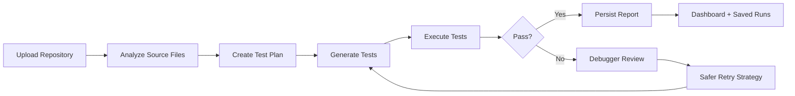

# AI Test Engineering

<p align="center">
  <strong>AI-powered repository testing with analysis, generation, execution, debugging, reporting, and deployment-friendly automation.</strong>
</p>

<p align="center">
  <a href="https://ai-test-engineering-codex-hackathon.vercel.app">Live App</a>
  &middot;
  <a href="https://ai-test-engineering-codex-hackathon.vercel.app/login">Login</a>
  &middot;
  <a href="https://ai-test-engineering-codex-hackathon.vercel.app/health">Health</a>
</p>

<p align="center">
  
  
  
  
  
  
</p>

---

## What This Is

AI Test Engineering is a FastAPI application that:

- analyzes uploaded repositories
- detects supported source files
- generates tests with heuristic or OpenAI-backed generation
- executes them with real runners
- retries more safely when failures occur
- stores reports and user-scoped run history
- exposes a visual dashboard for workflows, results, and profile data

It is built to stay product-facing while still being testable, deployable, and automation-friendly.

---

## Product Snapshot

| Area | What it does |
| --- | --- |
| `Overview` | upload a repo, choose a model, run the orchestration flow |
| `How It Works` | explains the planner, generator, executor, and debugger pipeline |
| `What To Do` | suggests next actions after a run |
| `Results` | shows saved runs and report details |
| `Profile` | user info, run stats, and account-linked workspace history |

---

## Architecture Flow



---

## Feature Surface

### Core capabilities

- Python, JavaScript, and TypeScript repository analysis
- AI model selection for test generation
- heuristic fallback when OpenAI is unavailable
- Google OAuth 2.0 sign-in
- DB-backed sessions and saved runs
- production deployment on Vercel
- isolated automated test architecture

### Current execution support

| Language | Analysis | Generation | Execution |
| --- | --- | --- | --- |
| Python | Yes | Yes | `pytest` |
| JavaScript | Yes | Yes | `node --test` |
| TypeScript | Yes | Yes | project tooling dependent |
| Other code uploads | Accepted | identified | reported as not yet executable |

---

## Quick Start

```powershell
python -m venv .venv
.venv\Scripts\Activate.ps1
pip install -r requirements.txt
uvicorn app.main:app --reload
```

Open locally:

- `http://127.0.0.1:8000/`
- `http://127.0.0.1:8000/login`
- `http://127.0.0.1:8000/reports`
- `http://127.0.0.1:8000/profile`

---

## Environment

```powershell
$env:OPENAI_API_KEY="your_api_key_here"
$env:OPENAI_MODEL="gpt-5-mini"
$env:OPENAI_REASONING_EFFORT="low"
$env:GOOGLE_CLIENT_ID="your_google_client_id.apps.googleusercontent.com"
$env:DATABASE_URL="sqlite:///./workspace/app.db"
```

Production should use a real external database, not SQLite.

---

## Testing Layer

The testing architecture is external and non-intrusive. It does not alter runtime UI, endpoints, request shapes, or business logic.

```text
automation/
  run_tests.py
tests/
  conftest.py
  unit/
  integration/
  e2e/
```

### Run tests

```powershell
pytest
pytest -m unit
pytest -m integration
pytest -m e2e
python automation\run_tests.py
```

### Generated reports

- `automation/reports/junit.xml`
- `automation/reports/coverage.xml`
- `automation/reports/htmlcov/`
- `automation/reports/summary.json`
- `automation/reports/summary.md`

---

## CI/CD

| Pipeline | Purpose |
| --- | --- |
| `.github/workflows/ci.yml` | runs automated tests and uploads reports |
| `.github/workflows/vercel-preview.yml` | preview deployment flow |
| `.github/workflows/vercel-production.yml` | production deployment flow |
| `Jenkinsfile` | Jenkins-compatible test runner pipeline |

GitHub Actions secrets:

- `VERCEL_TOKEN`
- `VERCEL_ORG_ID`
- `VERCEL_PROJECT_ID`

Recommended app secrets:

- `OPENAI_API_KEY`
- `DATABASE_URL`
- `GOOGLE_CLIENT_ID`

---

## OAuth Notes

Google Cloud Console values:

- Authorized JavaScript origins:
  - `http://127.0.0.1:8000`
  - `http://localhost:8000`
  - `https://ai-test-engineering-codex-hackathon.vercel.app`
- Authorized redirect URIs:
  - none required for the current popup-based flow

---

## Coverage Summary

Latest automated run:

- Test status: `PASS`
- Total tests: `30`
- Coverage: `70%`
- Current notable warning: deprecation warnings around `datetime.utcnow()`

### Best next coverage improvements

- add browser-driven UI verification for the full authenticated flow
- add more JavaScript and TypeScript execution fixtures
- add persistence-layer tests around saved runs and upload restoration
- add targeted coverage for error branches in API routes

---

## Repo Structure

<details>
<summary>Open project tree</summary>

```text
app/
  api/
  core/
  db/
  models/
  services/
  static/
  templates/
  utils/
automation/
tests/
.github/workflows/
Jenkinsfile
vercel.json
requirements.txt
pytest.ini
```

</details>

---

## Design Notes

This repo intentionally keeps:

- product UI separate from test architecture
- runtime logic separate from automation logic
- deployment concerns separate from repository analysis/generation logic
- local and CI/CD test execution aligned through the same automation runner

---

## Demo Video

[Watch the demo](https://github.com/user-attachments/assets/6496206c-f654-42d1-8dbd-268c217dd288)

---

## Status

> Active prototype with live deployment, authenticated dashboard, AI model selection, externalized testing architecture, durable upload recovery, and CI-ready execution pipeline.
